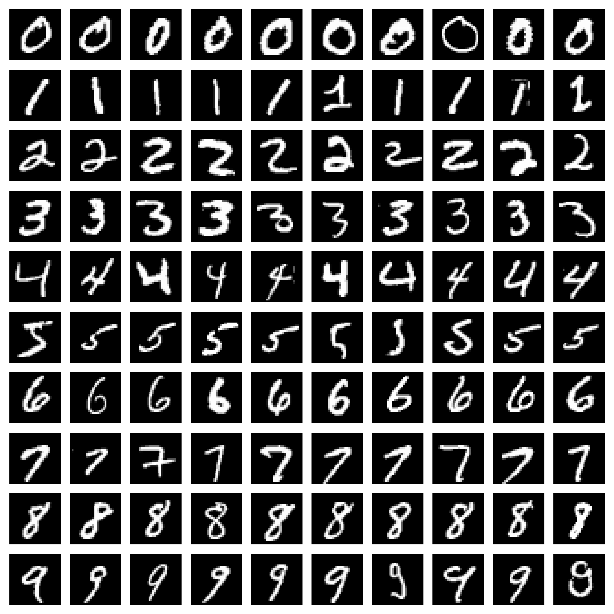

# Variational Autoencoder for Handwritten Digit Image Generation
This project implements a Variational Autoencoder (VAE) to generate handwritten digit images. The model learns a probabilistic latent representation from the input images, and can generate realistic-looking handwritten digits by sampling from the latent space.

A Conditional VAE is also implemented, which extends upon the vanilla VAE by passing in class labels during training and generation. This allows for controlled synthesis of images conditioned on the class label.


## How the VAE works
The VAE consists of two main components: The <b>encoder</b> and <b>decoder</b>. Between them lies the <b>latent space</b>.
- Encoder: Compresses the input image into a latent space.
- Decoder: Reverses the encoder's compression by reconstructing an image from the latent space.

In this implementation, the encoder and decoder are convolutional neural networks.


## How Conditional VAE is different
The conditional VAE introduces class labels to the encoder and decoder. This conditions the model to generate digits of a specific class, rather than sampling any digit randomly.


## What is latent space?
The latent space is a multi-dimensional co-ordinate system where the representation of input data is held.
The encoder component of the model encodes each handwritten digit image into the latent space as a normal distribution, parameterized by mean ($\mu$) and standard deviation ($\sigma$).
This distribution includes the range of possible handwritten variations for a specific digit.

Note: In practice, the encoder outputs mean ($\mu$) and specifically, log-variance ($\log$ $\sigma^2$), not standard deviation ($\sigma$).
Predicting $\log$ $\sigma^2$ is more numerically stable and also simplifies the loss calculation.


### Latent vector
A sample taken from the distribution of each digit's representation from the latent space is a latent vector $\mathbf{z}$.
This vector $\mathbf{z}$ represents a specific "variation" of a specific handwritten digit.
The decoder component of the model takes this latent vector and reconstructs an image, effectively reversing the process of the encoder.
Most reconstructions are synthetic rather than exact copies of the input images. This is because the sampled vectors often lie near (but not exactly on) the original latent embedding for that specific digit.

The ability to sample from a distribution to generate new digit variations makes the VAE model generative.


## Reparameterization trick
Drawing a random sample from a probability distribution is a stochastic operation, and not a smooth mathematical function of $\mu$ and $\sigma$. Directly sampling a latent vector from the encoder's distribution is not differentiable. The sampling operation needs to be differentiable because that’s the only way gradient descent can update parameters $\mu$ and $\sigma$, allowing the encoder to learn useful latent representations.

To solve this, the random sampling of vector $\mathbf{z}$ is re-expressed as a deterministic function of the encoder parameters and an extra random variable term:

$\mathbf{z} = \mu + \sigma \cdot \varepsilon$
- $\mu$ and $\sigma$ are encoder outputs
- $\varepsilon$ is random noise drawn from a standard normal distribution
- $\sigma$ is scaled by $\varepsilon$ to induce variability

This allows the separation of randomness ($\varepsilon$) from trainable parameters ($\mu$ and $\sigma$). $\mathbf{z}$ is now differentiable with respect to $\mu$ and $\sigma$.
The reparameterization trick makes it possible to backpropagate through the random sampling process.


## Loss function
The loss function used to train VAEs is composed of two terms: the reconstruction loss (BCE), and the regularization (KLD). <br>
$\mathcal{L} = \text{BCE} + \text{KLD}$

#### Reconstruction loss
The reconstruction loss term optimizes the decoder to ensure its output resembles real data. In this implementation, binary cross-entropy (BCE) is used, which is common when training on normalized grayscale images like MNIST.

$\text{BCE} = - \sum_i \left[ x_i \log(\hat{x}_i) + (1 - x_i)\log(1 - \hat{x}_i) \right]$
- $i$ iterates over all pixels
- $x$ is the original image
- $\hat{x}$ is the reconstructed image

#### Regularization
The regularization term is the <b>Kullback-Leibler divergence</b> (KLD). KL divergence regularizes the latent space by encouraging latent vectors to be close to a standard normal distribution. This prevents overfitting and makes the latent space continuous.

$\text{KLD} = -\tfrac{1}{2} \sum_j \left( 1 + \log \sigma_j^2 - \mu_j^2 - \sigma_j^2 \right)$
- $j$ iterates over each latent dimension
- $\log \sigma_j^2$ is the log-variance output from the encoder
- $\mu_j^2$ is the squared mean of latent distribution for dimension $j$
- $\sigma_j^2$ is the variance of latent distribution for dimension $j$

<br> Note: The VAE training objective is derived by maximizing the <b>Evidence Lower Bound (ELBO)</b> on the data log-likelihood.
In practice, this reduces to minimizing the sum of reconstruction loss (BCE) and the KL divergence, as described above.


---
- installation instructions, req.txt., dataset used, training and demo examples
[To be updated]

```sh
pyversion 3.12.9

pip install torch torchvision --index-url https://download.pytorch.org/whl/cu124
matplotlib==3.10.1
```

## MNIST dataset
The MNIST dataset is one of the most legendary datasets in machine learning. It contains 70,000 grayscale images of handwritten digits, each sized 28×28 pixels. 10 samples of each digit from the dataset is diaplyed below:



<p align="center">
  
</p>


## Model training
[work in progress]


## Generating images of handwritten digits
[work in progress]

