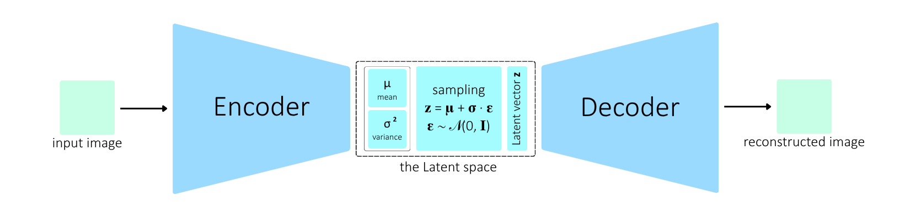
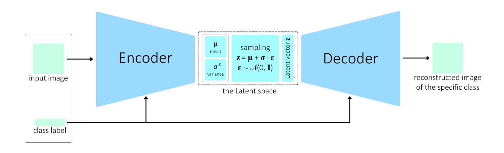
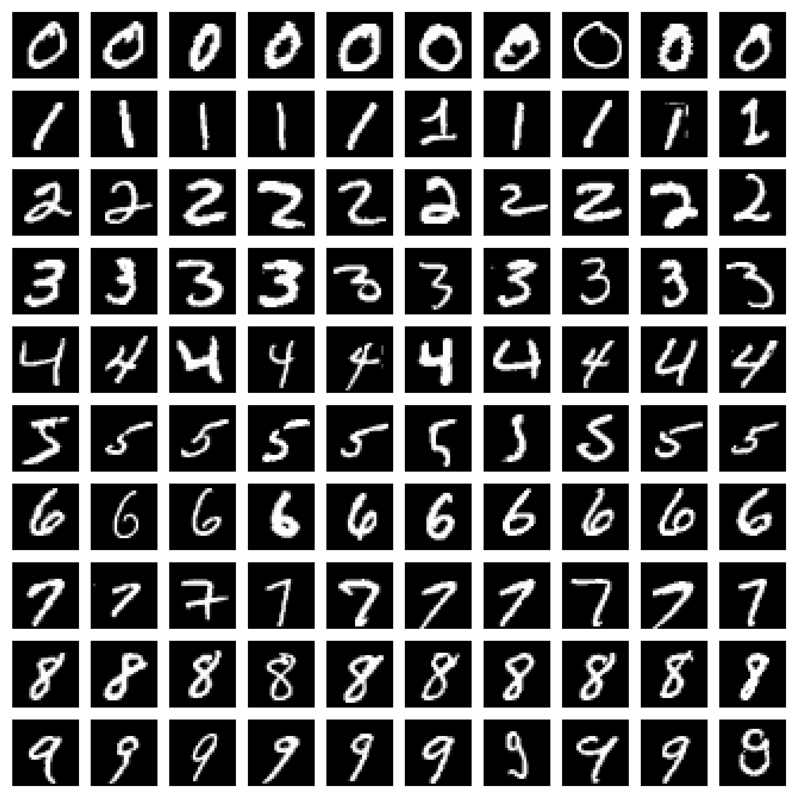
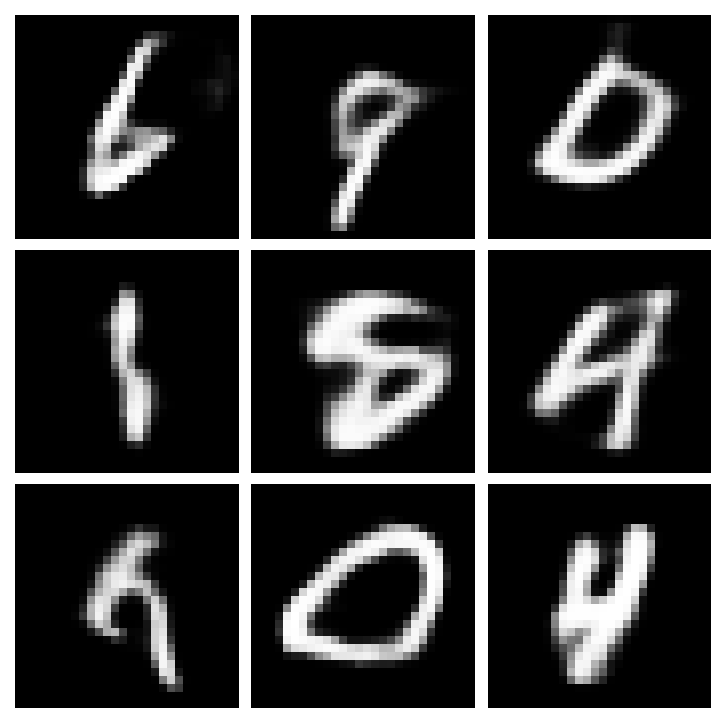
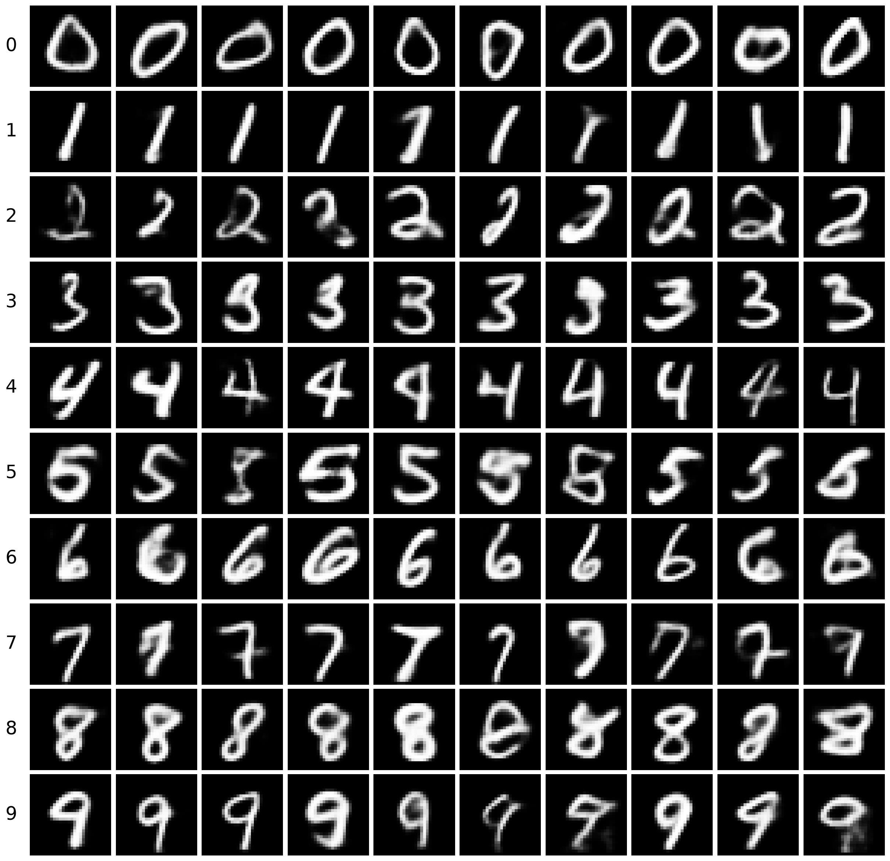

# Variational Autoencoder for Handwritten Digit Image Generation
This project implements a Variational Autoencoder (VAE) to generate handwritten digit images. The model learns a probabilistic latent representation from the input images, and can generate realistic-looking handwritten digits by sampling from the latent space.

A Conditional VAE is also implemented, which extends upon the vanilla VAE by passing in class labels during training and generation. This allows for controlled synthesis of images conditioned on the class label.


## How the VAE works

<p align="center">
    
</p>

The VAE consists of two main components: The <b>encoder</b> and <b>decoder</b>. Between them lies the <b>latent space</b>.
- Encoder: Compresses the input image into a latent space.
- Decoder: Reverses the encoder's compression by reconstructing an image from the latent space.

> In this implementation, the encoder and decoder are both convolutional neural networks.


### How the Conditional VAE is different

<p align="center">
    
</p>

The conditional VAE introduces class labels to the model. This conditions the model to generate digits of a specific class, rather than sampling any digit randomly.


## What is latent space?
The latent space is a multi-dimensional co-ordinate system where the representation of input data is held.

The number of dimensions in this co-ordinate system is set by the latent dimension, a design choice made before training. This implementation uses a `latent_dim` of 20, so the encoder outputs a mean and a variance for each of the 20 dimensions, describing where an image's distribution lies in the latent space. 

Too few dimensions and the model does not have enough capacity to encode the variation present in the data, resulting in blurry reconstructions. Too many dimensions and the model can overfit, resulting in a latent space full of gaps and nothing meaningful being learned, reducing the quality of generated images.

The encoder component of the model encodes each handwritten digit image into the latent space as a normal distribution, parameterized by mean ($\mu$) and standard deviation ($\sigma$).
This distribution includes the range of possible handwritten variations for a specific digit.

> Note: In practice, the encoder outputs mean ($\mu$) and specifically, log-variance ($\log$ $\sigma^2$), not standard deviation ($\sigma$).
Predicting $\log$ $\sigma^2$ is more numerically stable and also simplifies the loss calculation.


### Latent vector
A sample taken from the distribution of each digit's representation from the latent space is a latent vector $\mathbf{z}$.
This vector $\mathbf{z}$ represents a specific "variation" of a specific handwritten digit.
The decoder component of the model takes this latent vector and reconstructs an image, effectively reversing the process of the encoder.
Most reconstructions are synthetic rather than exact copies of the input images. This is because the sampled vectors often lie near (but not exactly on) the original latent embedding for that specific digit.

The ability to sample from a distribution to generate new digit variations makes the VAE model generative.


## Reparameterization trick
Drawing a random sample from a probability distribution is a stochastic operation, and not a smooth mathematical function of $\mu$ and $\sigma$. Directly sampling a latent vector from the encoder's distribution is not differentiable. The sampling operation needs to be differentiable because that’s the only way gradient descent can update parameters $\mu$ and $\sigma$, allowing the encoder to learn useful latent representations.

To solve this, the random sampling of vector $\mathbf{z}$ is re-expressed as a deterministic function of the encoder parameters and an extra random variable term:

$\mathbf{z} = \mu + \sigma \cdot \varepsilon$
- $\mu$ and $\sigma$ are encoder outputs
- $\varepsilon$ is random noise drawn from a standard normal distribution
- $\varepsilon$ is scaled by $\sigma$, so that the spread of the sampled vectors matches the distribution the encoder predicted

This allows the separation of randomness ($\varepsilon$) from trainable parameters ($\mu$ and $\sigma$). $\mathbf{z}$ is now differentiable with respect to $\mu$ and $\sigma$.
The reparameterization trick makes it possible to backpropagate through the random sampling process.


## Loss function
The loss function used to train VAEs is composed of two terms: the reconstruction loss (BCE), and the regularization (KLD). <br>
$\mathcal{L} = \text{BCE} + \text{KLD}$

### Reconstruction loss
The reconstruction loss term optimizes the decoder to ensure its output resembles real data. In this implementation, binary cross-entropy (BCE) is used, which is common when training on normalized grayscale images like MNIST.

$\text{BCE} = - \sum_i \left[ x_i \log(\hat{x}_i) + (1 - x_i)\log(1 - \hat{x}_i) \right]$
- $i$ iterates over all pixels
- $x$ is the original image
- $\hat{x}$ is the reconstructed image

### Regularization
The regularization term is the <b>Kullback-Leibler divergence</b> (KLD). KL divergence regularizes the latent space by encouraging latent vectors to be close to a standard normal distribution. This prevents overfitting and makes the latent space continuous.

$\text{KLD} = -\tfrac{1}{2} \sum_j \left( 1 + \log \sigma_j^2 - \mu_j^2 - \sigma_j^2 \right)$
- $j$ iterates over each latent dimension
- $\log \sigma_j^2$ is the log-variance output from the encoder
- $\mu_j^2$ is the squared mean of latent distribution for dimension $j$
- $\sigma_j^2$ is the variance of latent distribution for dimension $j$

<br>

> Note: The VAE training objective is derived by maximizing the <b>Evidence Lower Bound (ELBO)</b> on the data log-likelihood. In practice, this reduces to minimizing the sum of the reconstruction loss (BCE), and the KL divergence, as described above.

<br>


## Using the code in this repository

### Repository structure

```
├── models/
│   ├── vae.py      # encoder, decoder, and VAE
│   └── cvae.py     # label-conditioned encoder, decoder, and Conditional VAE
├── trainer/        # trainer functions for VAE and CVAE called by train.py 
│   ├── vae_trainer.py 
│   └── cvae_trainer.py
├── train.py        # entry point for training
├── sampler.py      # entry point for generation
└── demo.ipynb      # notebook for demonstration purposes
```

### Setup

Requires Python 3.12 (I used versions `3.12.9` and `3.12.12`).

```sh
git clone https://github.com/deepshiksharma/vae-mnist.git
cd vae-mnist

pip install -r requirements.txt
```

> Note: `torch` and `torchvision` is commented out in `requirements.txt`. 

Install PyTorch. To run on a CUDA-enabled GPU, install PyTorch with CUDA:
```sh
# check CUDA version compatibility of your GPU, and install as required
pip install torch torchvision --index-url https://download.pytorch.org/whl/cu124
```


### MNIST dataset
The MNIST dataset is one of the most legendary datasets in machine learning. It contains 70,000 grayscale images of handwritten digits, each sized 28×28 pixels. 10 samples of each digit from the dataset is displyed below:

<p align="center">
    
</p>

> Note: The MNIST dataset is downloaded automatically into `./MNIST/` on the first training run. No manual download is needed.


### Model training

`train.py` trains either model, taking which one as a command line argument:
```sh
python train.py vae                # Train the variational autoencoder
python train.py conditional_vae    # Train the conditional variational autoencoder
```

Training parameters are defined in a dictionary near the top of `train.py`, and are printed for confirmation before training begins. <br>
The default values are:
| Parameter | Default |
| --- | --- |
| `learning_rate` | 1e-3 |
| `num_epochs` | 3 |
| `batch_size` | 64 |

> Note: The size of the latent space is set by the `latent_dim` argument of the model classes in `models/`, and defaults to 20. It is not part of the training parameters above, so it does not appear in the output directory name. `sampler.py` and `demo.ipynb` both assume `latent_dim` is 20.

Both models are optimized with Adam against the combined BCE + KLD objective. The MNIST training split (60,000 images) is used for training and the test split (10,000 images) for validation, with the loss reported per sample at the end of every epoch.

Each run writes to its own subdir within `outputs/`, named after the parameters used during training. <br>
For example, for the VAE model trained for 10 epochs using an LR of 0.001 and a batch size of 64:
```
outputs/vae epoch_10 lr_0.001 bsize_64/
├── weights.pth    # trained model weights
└── loss.png       # training and validation loss curves
```

> Note: Changing the training parameters changes the output directory name. The weight paths in `sampler.py` and `demo.ipynb` are hardcoded, and need to be updated to match.


### Generating images of handwritten digits

After training is completed, the encoder is no longer needed. Just the decoder is needed for generation. A latent vector $\mathbf{z}$ is drawn from the prior $\mathcal{N}(0, \mathbf{I})$ and passed through the decoder, which reconstructs an image from it. <br>
Because that vector was not produced by encoding a real image, the digit that comes out is synthetic. The model is not retrieving a training image, it is decoding a point in a latent space that it learned to make continuous.


#### From the command line

```sh
python sampler.py vae                  # Sample random digits from the variational autoencoder
python sampler.py conditional_vae 7    # Sample digit 7 from the conditional variational autoencoder
```

Each run generates 9 images and displays them as a 3×3 grid in a matplotlib window. Nothing is written to disk automatically; use the save icon in the window's toolbar to keep a figure. Every run draws fresh latent vectors, so the same command twice gives a different set of digits.


#### From the notebook

`demo.ipynb` does the same thing with the images rendered inline, 16 per grid, along with a grid of every digit at once.


#### Conditioning

The vanilla VAE takes no direction, and cannot be asked to generate a specific digit. It never saw class labels during training, so its latent space holds no digit axis and no record of which region corresponds to which class.

Digits of the same class do cluster together, since similar images encode to similar latent vectors, but those clusters are unlabelled. Sampling from the prior lands somewhere in the latent space at random.

<p align="center">
    
    <br> <sub> Nine samples generated by the vanilla VAE. The digits that appear are whatever the randomly drawn latent vectors happened to decode to. </sub>
</p> <br>

The conditional VAE takes in an argument that specifies which digit to generate. The latent vector is still drawn at random from the prior, but the class label is one-hot encoded and concatenated to it before it reaches the decoder (as done during training). Holding the digit fixed while the latent vector varies is what makes the conditioning visible. The same digit written in different ways, varying in slant, stroke thickness, loop size and proportion.

<p align="center">
    
    <br> <sub> Ten samples of every digit generated by the conditional VAE. The class is fixed along each row while the latent vector varies, so what changes within a row is handwriting style rather than identity. </sub>
</p>
